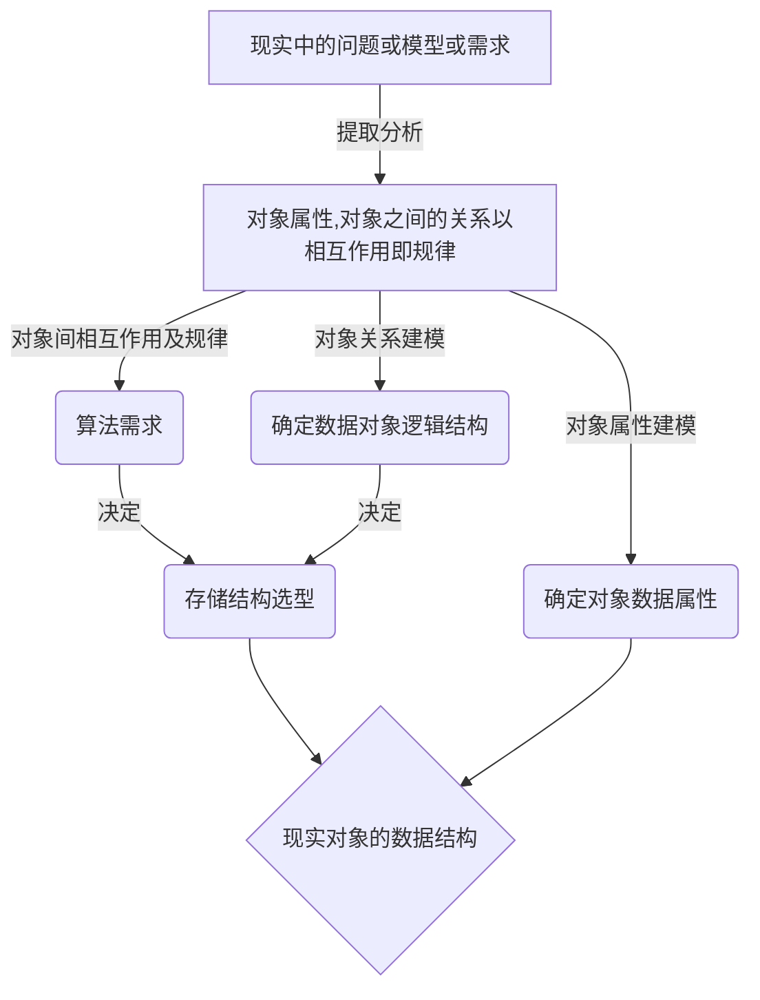

- 某以数据结构下的问题需要可能依赖另一种数据结构才能解决：如*堆栈，列表，哈希表*，这些都是比较万金油的数据结构
- 当问题结构不依赖与输入规模时，可以考虑：`递归->递归+备忘录减枝->递推->动态规划->`
- 利用数组下标记录信息

*所有的数据结构都源自**链表**和**数组**，而**字节的编码和解码**实现了链表和数组*

# `ris:ArchiveDrawer`数据结构
#迷思

**为什么学习数据结构？**
数据结构可谓是计算机基础中的基础，相当与编程的第一原理。但凡涉及算法的实现都离不开数据结构的建模。

结构视角解读数据结构：*数据结构=数据存储结构+数据的逻辑结构+算法*
应用视角解读数据结构：数据结构就是将现实中的模型，抽向到计算机世界进行模拟，在这个过程中，我们要将现实中的事物关系，通过数据之间的联系在计算机中表示。
那么，**如何用数据结构的思想解决现实的编程问题？**


虽然已经知道了这个具体的流程，但还是不足以支持我们写出代码。
这是为什么呢?在这里我们忽略了一个最基本但又很容易被我们忽视的问题——**计算机为我们提供什么样的支持，来实现我们的数据结构?**
让我们回到一切的开始——计算机是如何存储数据的（坑位），不同的存储方式会衍生出不同的元数据结构
比如：
- 顺序结构——数组，字符串
- 链式结构——字符串
- 索引结构——树，图
- 哈希结构——字典

由此我们得出了计算机为我们提供的最基本的支持——*数组，和数据编码*
数组是因为计算机硬件结构决定了所有的数据都是以二进制的方式


- **学习数据结构对我们编程会产生怎样的影响？**


# `ris:BookOpen` 算法思想的设计与实现


## `ris:Tools`设计篇

### 递归

自顶向下
```java
public ListNode reverseList(args[]){
	if(endCondition)
		reutrn someting;

	{logic...}

	LiseNode reverse = reverseList(args[])

	{logic...}
}
```

### 递推

## `ris:MentalHealth`思想篇

1. 动态规划通常用于解决什么样的问题？
	最优化问题，我们通过作出一组选择来表示最优解；而且每次做出选择后，都会得到相同结构的子问题。
 
2. 动态规划实现的关键在于哪里？
	对每个子问题的解进行保存，以避免重复计算

 3. 贪心算法同样用与解决最优化问题，但优质贪心策略得到的可能不是全局最优；所以需要在意的是当满足什么条件时，贪心策略的解就是最优解？
	  **拟阵理论**：

  4. 对于有相同子问题结构的算法，我们如何分析其复杂度？
	  **摊还分析**：


### 动态规划

- 无后效性：之前的状态不会受后续输入改变，后续输入的结果只依赖之前的状态

- 最优子结构：将问题划分为若干子问题，且问题最优解包含子问题最优解

- 状态转移方程(**递推方程**)：问题与子问题的关系，用数学表达式给出

- 边界：已知的起始状态

- 重叠子问题(**可制作备忘录**)：被重复解决的子问题，一般可用备忘录的方式避免重复计算

#### 算法设计

步骤：
1. 刻画一个最优解结构特征：最优子结构，转移方程，边界，重叠子问题
2. 递归定义最优解的值：
3. 计算最优解的值：
4. 利用计算的得出的信息构造最优解： 
> 仅通过前三步可以得到一个最优解，第四步则可以得到所有最优解；如果需要第四步，那么在第三步时就要维护一些额外信息，构造最优解

以跳蛙问题为例：

| 最优子结构               | 状态转移方程         | 边界              | 重叠子问题 |
| ------------------------ | -------------------- | ----------------- | ---------- |
| `f(n-1)` `f(n-2)` `f(n)` | `f(n)=f(n-1)+f(n-2)` | `f(1)=1` `f(2)=2` | `f(n-2)`   | 

>★ 一道动态规划问题，其实就是一个递推问题。假设当前决策结果是f(n),则最优子结构就是要让 f(n-k) 最优,最优子结构性质就是能让转移到n的状态是最优的,并且与后面的决策没有关系,即让后面的决策安心地使用前面的局部最优解的一种性质

### 分治思想

拥有最优子结构，但无重叠子问题

自底向上


### 穷举算法

### 贪心算法


# `ris:Sword`算法应用

## 搜索
- 枚举
- 深度搜索
- 广度搜索
- A*
- 回溯
- 蒙特卡洛树
- 哈希算法

## 近似解

蒙特卡罗模拟——问题与概率有关


## 查询
### 二分查找
[[Algorithm_DS指北#关于溢出和op优先级的问题]]需要注意！
掌握二分查找的关键在于
- 查找条件：l <= r 和 l < r
- 判断条件：依有序表排序决定
- 边界更新方式：l=mid+1; r=mid-1;
以上三个要素判断不准确容易出现系循环或者遗漏区域
```java
//标准版二分查找
public int standardBinSerach(int nums[],int target){
	int left=0,right = nums.length-1;
	while(left<=rigth){
		//之所以这样写是为了防止溢出
		int mid = left + (right-left)/2;
		//找到所要元素
		if(num[mid]==target)return mid;
		if(nums[mid]<target)left = mid + 1;
		else right = mid-1;
	}
	return -1
}
//二分查找也适用于部分有序的情景
```


# `ris:Slack`基于数据不同数据结构的算法技巧

## 关于位运算

`n&1==0` 进行奇偶判断，如果n是偶数则成立

`n%2==1` == `n&1==1`

`n&(n-1)`：消去最后一位1
如果n为2的幂次，则`n&(n-1)==0`

## 关于链表和数组

### 双指针
可以用于记录节点前驱，方便回溯和防止断链

### 哨兵
设置一个不携带有效数据的头指针，指向表头；这样*可以轻松删除头头节点*

## 关于字符串

这些工具方法会提高你处理字符串的效率，我的意思是，每种语言有字符串这个数据结构，你要记住一些这种语言用于处理字符串的名字
```python
# 转换
int(str,2)  # 将二进制字符串转为int类型
int(str,16) # 将十六进制字符串转为int类型
int(str)    # 将数字传转对应整数
ord('a')    # 将字符a转十进制ascii码
bin(13)     # 将13转二进制形式，前两位为0b
chr(69)     # 将69转为对应的ascii码字符

# 查询
string.find(str1)  # 寻找string左边第一个str1
string.rfind(str1) # 寻找string右边第一个str1

# 扩展
string.zfill(32)   # 指定字符串长，不足32右对齐，高为补0
string.join(str1)  # 将string与str1连接，str1可以是字符串也是字符串列表

```

- KMP
- BM
- Sunday
- Horspool
- RK

# `ris:Pushpin`一些细节问题

## 关于溢出和op优先级的问题
1. `(l+r)\2`和`l+(r-l)/2`以及`l+((r-l)>>1)`；这三个表达式都有具有相同的做作用，但在实际编程中却会导致不同的结果；首先说第一种方式两数相加会导致溢出是一种不安全的表达式；第二种和第三种并不会发生溢出，但是第四种的移位操作需要用括号包裹，因为以为操作的优先级要小于加减法，这会导致我们意想不到的错误。
2. 有时为了防止溢出，我们会将`int`类型替换为`long`类型。