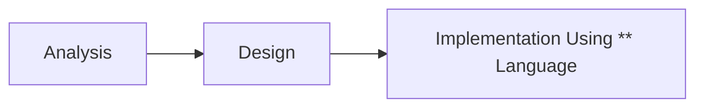

面向对象设计工作流

前两个阶段可以通俗的理解为确定一个与现实对象对应的数据结构。
而UML在其中的作用就是**将对象的数据结构可视化**。
```toc
```
## 概述
### Analysis
目表：确定一种合适的**数据类型**来描述对象

### Design
目的：设计对象之间的协作方式

### Impementation
选用合适的语言来实现对象的**数据结构**。

## UML基本元素
### 事务
#### 结构事务
类
![[Pasted image 20230228003442.png]]
接口
类或组件所提供的服务（操作），描述了类或组件对外可见的动作；
![[Pasted image 20230228003455.png]]

协作
![[Pasted image 20230228003511.png]]

用例
![[Pasted image 20230228003554.png]]
组件
![[Pasted image 20230228102939.png]]![[Pasted image 20230228003603.png]]
节点
![[Pasted image 20230228003614.png]]![[Pasted image 20230228102922.png]]

#### 行为事务
交互
![[Pasted image 20230228003629.png]]
状态机
![[Pasted image 20230228003645.png]]

#### 分组事务
包：结构事物、动作事物甚至分组事物都有可能放在一个包中。
封装是唯一一个分组事物可收集结构和行为的东西
![[Pasted image 20230228003834.png]]
#### 注释事务
注释用于渲染意见，约束等的UML元素
![[Pasted image 20230228003916.png]]
### 关系
#### 依赖
两件事物之间的语义联系，其中一个事物的变化也影响到另一个事物。
![[Pasted image 20230228003930.png]]
#### 关联
一种描述一组对象之间连接的结构关系，如聚合关系（描述了整体和部分间的结构关系）
![[Pasted image 20230228004007.png]]
#### 实现
类之间的语义关系，其中的一个类指定了由另一个类保证执行的契约
![[Pasted image 20230228004028.png]]
#### 泛化
泛化可以被定义为一个专门的元件连接关系与一个广义的元素，它基本上描述了在对象世界中的继承关系，是一种一般化-特殊化的关系；
![[Pasted image 20230228004054.png]]

### 图
#### 静态图
##### 类图
*唯一可以直接映射到面对象语言的UML图，描述了一个系统中各种对象之间的关系*。
![[Pasted image 20230228102512.png|300]]![[Pasted image 20230228103636.jpg|300]]
##### 对象图
*参与交互的对象，某一时刻的状态，可看做是类图在某一时刻的实例。*
![[Pasted image 20230228102524.png|300]]![[Pasted image 20230228103741.jpg|300]]
对象图可看作系统运行时的快照

##### 组件图
实现角度的系统设计，*描述系统的静态实现视图，组件包括库、档案、文件夹等。*
**Component Diagram=component+interface+relationship+port+connector**
![[Pasted image 20230228102834.png]]![[Pasted image 20230228104106.jpg|300]]
USAGE：建模系统、数据库架构、可执行文件组织、源码组织

##### 部署图
*描述一个系统的静态部署，由节点以及节点之间的关系组成。* 可视化系统硬件拓扑，描述部署软件的硬件组件，以及运行时的处理节点。
部署图由[[UML#结构事务]]中的节点组成，每个系统只有一个唯一的部署图。
![[Pasted image 20230228104321.png|300]]![[Pasted image 20230228104401.png|300]]![[Pasted image 20230228104415.png|300]]

![[Pasted image 20230228104636.jpg|300]]

##### 包图
![[Pasted image 20230228103136.png|300]]

#### 动态图
##### 用例图
用户角度的系统设计，*指出各种功能的操作者*。
![[Pasted image 20230228102649.png|300]]

##### 状态图
*描述从一个状态到另一个状态的流程，主要有外部事件的参与。*
![[Pasted image 20230228103112.png|300]]
##### 活动图
活动图定义：*活动图描述满足用例要求所要进行的活动以及活动间的约束关系*，有利于识别并行活动。活动图是一种特殊的状态图，它对于系统的功能建模特别重要，强调对象间的控制流程。

##### 交互图
*显示对象间动态合作关系，强调对象之间消息的发送***时序**。
![[Pasted image 20230228103002.png|300]]

## UML建模——系统架构
系统架构是真个系统的蓝图，**包图**根据架构模型进行构建。
### 结构建模
主要使用[[UML#UML基本元素#静态图]]，进行建模
### 行为建模
主要使用[[UML#动态图]]，进行建模
## 公共机制