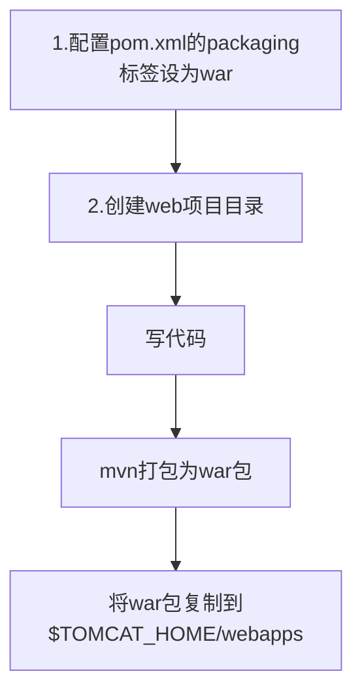

# 前端开发
[[前端指南]]

# 后端开发


## 服务器
[[Tomcat]]
[[HTTP]]

## Web.xml的作用
用于配置初始化信息：
- welcome页面
```xml
<welcome-file-list>
<!--优先级依次递减-->
	<welcome-file>index.html</welcome-file>
	<welcome-file>index.jsp</welcome-file>
</welcome-file-list>
```
- servlet 命名
```xml
<servlet>
	<servlet-name>servlet_name</servlet-name>
	<servlet-class>com.itheima.TestServlet</servlet-class>
	<init-param>
		<param-name>userName</param-name>
		<param-value>Daniel</param-value>
	</init-param>
</servlet>
```
> servlet可通过调用getServletConfig().getInitParameter("param1")来获取参数名对应的值
- servlet-mapping 定制URL
```xml
<servlet-mapping>
<servlet-name>servlet_name</servlet-name>
<url-pattern>*.do</url-pattern>
</servlet-mapping>
```
- filter 
- listener
```xml
<listener>
	<listener-class>com.itheima.listener.XXXListener</listener-class>
</listener>
```
- 启动级别


## JavaWeb组件

| 组件     | 作用                                         | 特点                                                                               |
| -------- | -------------------------------------------- | ---------------------------------------------------------------------------------- |
| Servlet  | 服务端小程序，负责接收客户端请求并作出响应   | 单例，首次访问时创建，然后放入缓存；创建完毕执行init，每个Servlet有一个service方法；一个业务对应一个Servlet      |
| Filter   | 过滤器，对客户端请求进行过滤                 | 单例，服务器启动时创建，执行init，对于符合要求的请求放行，执行过滤的方法为doFilter |
| Listener | 监听器，负责对域对象的创建和属性变化进行监听 | 监听域可分为Request、Session、ServletContext                                       |

### DispatcherServlet前端控制器
#HTTP #tomcat #B/S架构 #C/S架构

![[Pasted image 20230419095341.png|550]]
B/S
应用数据和逻辑存储于服务器
- 维护方便
- 体验一般
C/S
应用数据和逻辑存储于本地，需要单独下载应用程序
- 开发维护麻烦
- 体验不错
