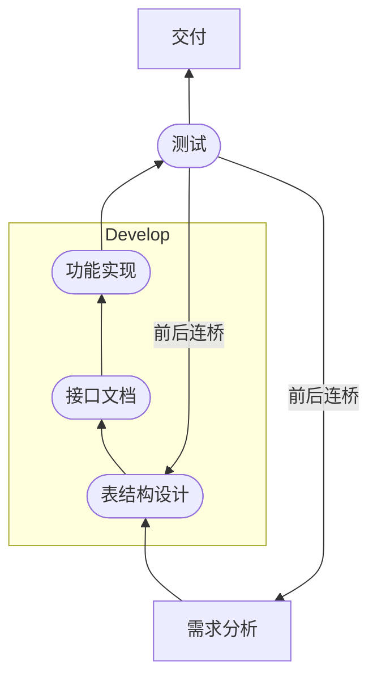

# `ris:Bank`企业开发模式

![[Pasted image 20230424091412.png|700]]

# 需求分析

## 业务逻辑

## 技术选型

要考虑的问题：
1. 哪些技术可以满足业务需求？
2. 

实现语言：[[Java]]、[[Python]]、[[C++]]、[[C]]、[[JS]]、[[Lua]]、[[Rust]]
服务器：[[Tomcat]]、[[Nginx]]、[[Redis]]

## 架构设计

# 表结构设计

[[Mysql#数据库设计]]

1. 首先，画出需求中业务对象的ER图，着重体现对象的数量关系，可参考：[[Mysql#多表设计]]

2. 根据数量关系建表

# 接口文档

# 功能实现
桥后分离式开发模式：
![[Pasted image 20230419104546.png|500]]

# 测试

