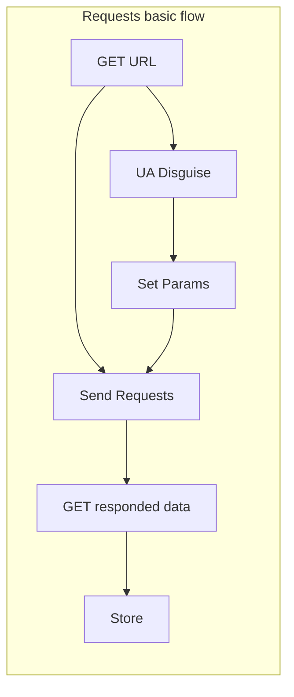
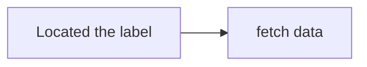
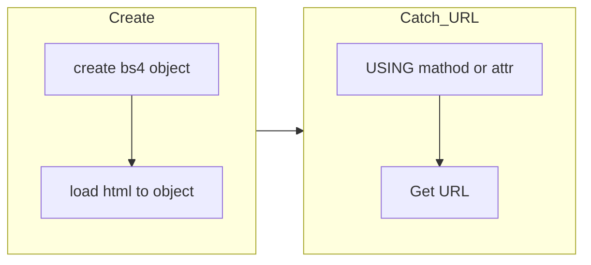
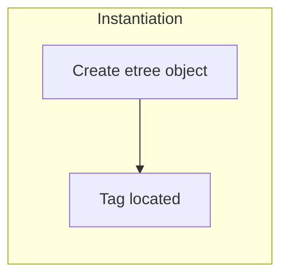

```toc
```

## Model
### requests
Function: Stimulate Browse send requests.
```python
import requests
response = requests.request()
# return a response object
# the method of requests is consistent with HTTP's Request
# there is a normal frame "requests.reqest(method,url,args);".
# set response's encoding, requests default encoding is "ISO-8859-1"
response.encoding = 'utf-8'
page_text = response.text
# web page's source
# Struction: 
# response line: protocal version and state number
# state:200(OK) 302(relocation) 304(using browse cache)
# 404(via incorrect) 405(request and method not match)
# 500(server source code fail)
# response head: formal(key:value) which include encoding,etc.
# response body: data
# if what reclocation you need to change the response head.
```


#### HTTP Request
- GET: return a object.
- HEAD: return a header of the object.
(PS: GET and HEAD only get sourse with no action.)
- POST: post the data which will be dealed with. How to deal with depend on Server.
- PUT: Create a new sourse or update the sourse on Server.
(PS:The deffierent between "post" and "put" is url's usage. In post method, the url is used to deal with the data. In contrast, the put method's url is used to change.)
- CONNECT
- OPTIONS: View performance of The Server on Client.
- TRACE: Appear the Request which Server received.
- PATCH: The supplement for PUT, it can update locally.
>幂等性：某个操作执行一次的结果与执行N次的结果相同，称该操作具有幂等性，因此GET，HEAD，DELETE，PUT具有幂等性，而PUT不具备幂等性。

#### UA disguse
```python
header = {
		  'User-Agent':'Mozilla/5.0 (Windows NT 10.0; Win64; x64) AppleWebKit/537.36 (KHTML, like Gecko) Chrome/108.0.0.0 Safari/537.36 Edg/108.0.1462.54'
}
```

### urllib

## Data Analysis
Gets the specified content.(本质就是从HTML文本中找到，爬取资源的URL。
### 通用解析原理
- 解析的局部文本内容都会聚焦于标签之间或标签属性中

### Regular expression
[Regular expression test](https://regexone.com/)
Matching the sources url by using regular expression.

### BS4

#### Dependent
```python
pip install bs4
pip install lxml
```
#### USAGE
Load
```python
# Load HTML
# Way1
fp = open("./abc.html",'r','utf-8')
soup = BeautifulSoup(fp,"lxml")
# Way2
text = response.text
soup = BeautifulSoup(text,"lxml")
```
Analysis
```python
# return the first tag in html
soup.tagname
soup.find('tagname')
# for example
# soup.a or soup.find('a')
# soup.li or soup.find('li')
# soup.div or soup.find('div')
# etc.

# class loacted return a string
soup.find('tagname',class_='classname')
soup.find('tagname',id_='idname')
soup.find('tagname',attr_='attrname')
soup.find_all('tagname') 
# find_all() return a list which include all of tags that accord with condition.

soup.select("selector(id/class/tag)")
soup.select(".tang > ul > li > a")[k]
soup.select(".tang a")
# Support Levels Located, SPACE means several levels, > means one level
# return a list which include all of selector's tags.
soup.select('selector')[k]['attr']
# get tag's attr

# Get tags content
soup.tagname.text/string/get_text()
# string method get tag's direct content
# text or get_text() get tag's all content
```

### XPATH(RECOMMAND!!)

Instantiation
```python
from lxml import etree
# Local load
html_tree = etree.parse(filePath)
# Web load
html_tree = etree.HTML(requests.get(url,head).text)
```
Locate
```python
# locate tag, then return several Element object.
tag_line = html_tree.xpath('xpath expression')
# locate tag's attribute, then return a Element oject.
tag_line = html_tree.xpath('xpath expression/tag[@class="class_name"]')
```
Get tag's content
```python
# return a list
tag_content = html_tree.xpath('xpath/tag[@attName]="value"/subtagname/text()')
# return a string
tag_content = html_tree.xpath('xpath/tag[@attName]="value"/subtagname/text()')[k]
```
#### xpath expression: 
标签名目录+标签属性+子标签序号
- /:locating start at root, or denote level
- //: denote  spanning two levels or locate at any level
- attr locate: experssion: **tag's xpath/tagname\[@attrName='attr value'\]**
- index locate: **tag[@attrName="value"]/tag's sub\[k\]** , get tag's the kth subtag.(*index start at 1*)
- get text: /text() or //text()
- get attr: /@attrName


#### DEPENDENT
```bash
pip install lxml
```
