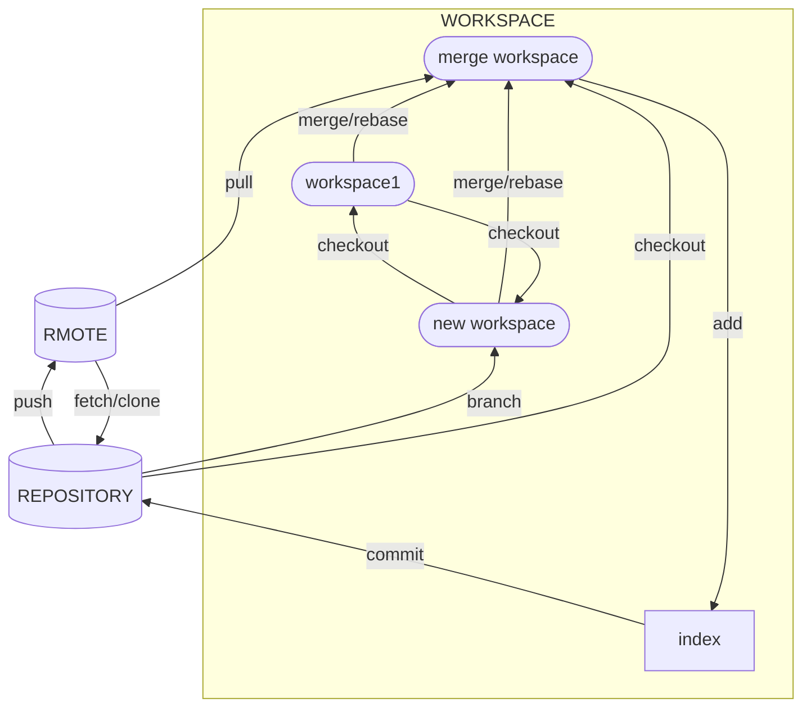

```toc
```

## Work Flow
- git作为一个版本管理工具，就是要实现并记录代码的变更，并通过对记录的合并，撤销等一系列操作实现版本控制
HEAD point to present workspace.


## CONFIG
```
git config --global user.name "Ze"
git config --global user.email 1609738019@qq.com

# set porxy
git config --global https.proxy #on
git config --global --unset https.proxy #off
```

## 本地操作Workspace&Repository
### add——提交缓存
- `git add` 将修改添加到当前workspace的提交缓存index

### commit&cherry-pick——生成一次提交
- `git commit` 提交当前HEAD所指workspace下的修改

### branch——创建本地新分支
- `git branch A` 为当前HEAD指向的提交节点命名为A分支
- `git branch -f A B` 将分支A移动到B对应的提交节点
### checkout & HEAD & `branch -f` ——提交树中的移动

### merge&rebase&cherry-pick——合并，整理提交记录
分支和并的本质就是将各分支的提交合并成一个提交从而生成一个新的版本。
- `git merge ` 
- `git rebase ` 变基
- `git rebase --interactive HEAD~n` or `git rebase -i HEAD~n`取HEAD及以上n-1个提交节点，并进入UI界面，在UI界面中可以选择需要的提交，并修改提交的顺序；推出UI后会产生新的分支。
- `git cherry-pick A B C` 将A,B,C提交复制到当前HEAD下从而生成一个新的版本，需要注意的式ABC复制到当前head时，会在该分支产生三个提交记录。（cherry-pick的意思是摘选樱桃，就像摘樱桃一样，我们只需要将我们想要的提交摘下来放到自己的篮子里就可以）

### tag&describe——里程碑
- `git tag tag_name C1` 在C1建立tag_name里程碑
- `git describe node` 查看node点处的历程信息，`上一个最近里程碑+距离里程碑的距离+当前哈希值`

### reset&revert——撤销提交

### `head~n` & `head^n`
`head~n` 指head向n-1个提交，`head^n`指head的第n个父节点（一个提交对应有多个父节点的情况）


## 远程操作
### Origin
origin 分支永远指向远程仓库的当前分支，只有使用fetch或者pull是才会在本地发生改变。
#### corporate problem
当处于协作工作时，由于队友的提交会导致远程的origin于本地的origin不一致，这是就**不能使用push来提交修改**了。
因此可以
- Plan1：**先fetch远程的修改，然后rebase/merge到新的origin，最后push修改**。
- Plan2：`git pull --rebase & git push`，其中`git pull --rebase`是将远程的修改合并到本地，同时跟新origin的位置，因为本地origin与远程origin一致所以可以使用`git push`
#### remote tracking
`git checkout -b newmain o/main` or `git branch -u o/main newmain` 使本地newmain分支跟踪远程的main分支，push和pull本地newmain分支时，会直接作用到远程的o/main分支。

### push——推送数据(远程同步)
`git push <origin> <place>` 将本地的修改推送给远程仓库（本地分支与远程分支同名）
`git push <origin> <source>:<destination>` 将本`source`推送到远程分支`<destination>`
#### Main lock problem
`Remote Reject` 远程服务器拒接推送到main，因为使用了pull request机制，你的推送需要经过库拥有者审核才可提交，并且你的o/main与远程库中的o/main不同，所以拒绝提交。
因此，我们正确的做法是，新建一个分支提交新分支，并且将你目前的main分支reset与远程服务器保持一致。

### clone & fetch & pull —— 从远程获取数据(远程同步)
- `git clone '(http/git)://url/repository_name/branch_name'` 将Remote仓库克隆到本地。
- `git fetch <origin> <source>:<destination>` 会将全程仓库的提交更新到本地仓库，但并不意味这本地与远程的同步，因为该命令并不会改变本地做出的修改，它仅仅是将本地没有而远程有的修改更新过来。将远程仓库origin中`sourece`分支跟同步更新到本地`destination` 分支。
- `git pull` 等效于 `git fetch;git merge` 
### revert


### remote


